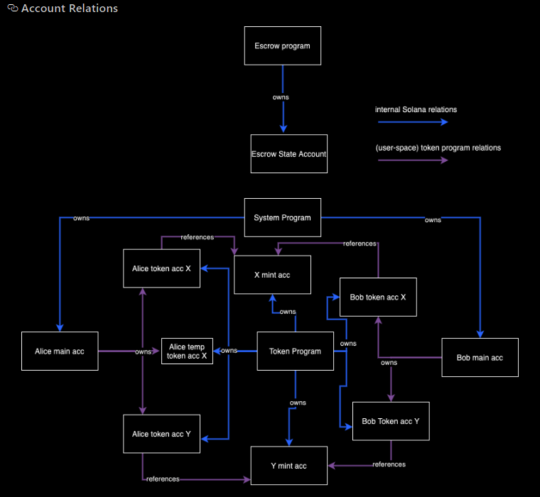

# Example of Escrow Contract

## Blockchain

-   Solana

## Network

-   Localhost

## Language

-   Rust
-   Type Script

## Framework

-   Anchor

## Escrow contract

    ● Maintains separate accounts for each user, allowing efficient handling of multiple users simultaneously
    ● Allows for the multi-call of entrypoints: deposit and withdraw in single transaction (swap).
    ● Only the owner of an account should be able to withdraw funds from their respective escrow account.
    ● Utilizing a generic token type (SPL Token, Erc20, PSP22) based on your chosen ecosystem.
    ● Address potential security concerns, particularly vulnerabilities like reentrancy.
    ● Includes end-to-end unit tests using type script.

## Structure

### Initialize

Initializer can send a tx to the escrow program to setup the Vault. In this tx, two new accounts: Vault and EscrowAccount, will be created and tokens (Token A) to be exchanged will be transfered from Initializer to Vault.

#### Initialize Structure:

-   initializer: `AccountInfo` - Signer of InitialEscrow instruction. To be stored in EscrowAccount
-   initializer_deposit_token_account: `Account<TokenAccount>` - The account of token account for token exchange. To be stored in EscrowAccount
-   initializer_receive_token_account: `Account<TokenAccount>` - The account of token account for token exchange. To be stored in EscrowAccount
-   token_program: `AccountInfo` - The account of TokenProgram
-   escrow_account: `Box<Account<EscrowAccount>>` - The account of EscrowAccount
-   vault_account: `Account<TokenAccount>` - The account of Vault, which is created by Anchor via constraints.
-   mint: `Account<Mint>`
-   system_program: `AccountInfo`
-   rent: `Sysvar<Rent>`

### Cancel

Initializer can also send a tx to escrow program to cancel its demand. The tokens will be transfered back to the Initialzer and both Vault and EscrowAccount will be closed in this case.

#### Cancel Structure:

-   initializer `AccountInfo` The initializer of EscrowAccount
-   initializer_deposit_token_account: `Account<TokenAccount>` - The address of token account for token exchange
-   vault_account: `Account<TokenAccount>` The program derived address
-   vault_authority: `AccountInfo` - The program derived address
-   escrow_account: `Box<Account<EscrowAccount>>` - The address of EscrowAccount. Have to check if the EscrowAccount follows certain constraints.
-   token_program: `AccountInfo` - The address of TokenProgram

### Exchange

Taker can send a tx to the escrow to exchange Token B for Token A. First, tokens (Token B) will be transfered from Taker to Initializer. Afterward, the tokens (Token A) kept in the Vault will be transfered to Taker. Finally, both Vault and EscrowAccount will be closed.

#### Exchange Structure:

-   taker: `AccountInfo` - Singer of Exchange instruction
-   taker_deposit_token_account: `Account<TokenAccount>` - Token account for token exchange
-   taker_receive_token_account: `Account<TokenAccount>` - Token account for token exchange
-   initializer_deposit_token_account: `Account<TokenAccount>` - Token account for token exchange
-   initializer_receive_token_account: `Account<TokenAccount>` - Token account for token exchange
-   initializer: `AccountInfo` - To be used in constraints. (Will explain in part 3)
-   escrow_account: `Box<Account<EscrowAccount>>` - The address of EscrowAccount. Have to check if the EscrowAccount follows certain constraints.
-   vault_account: `Account<TokenAccount>` - The program derived address
-   vault_authority: `AccountInfo` - The program derived address
-   token_program: `AccountInfo` - The address of TokenProgram
